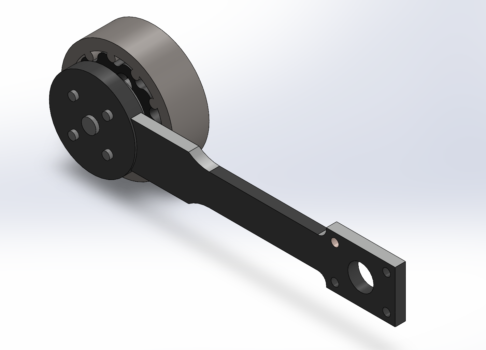
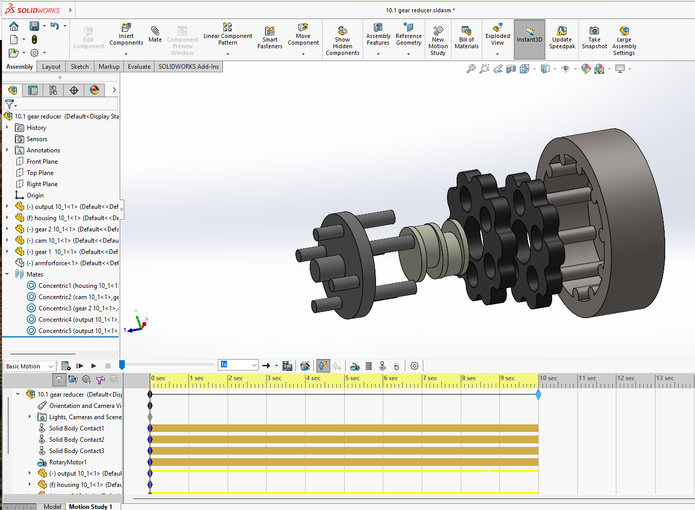
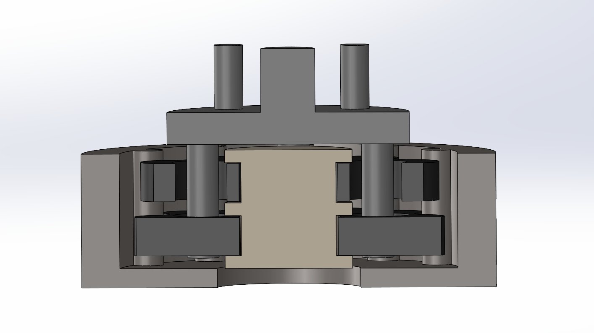
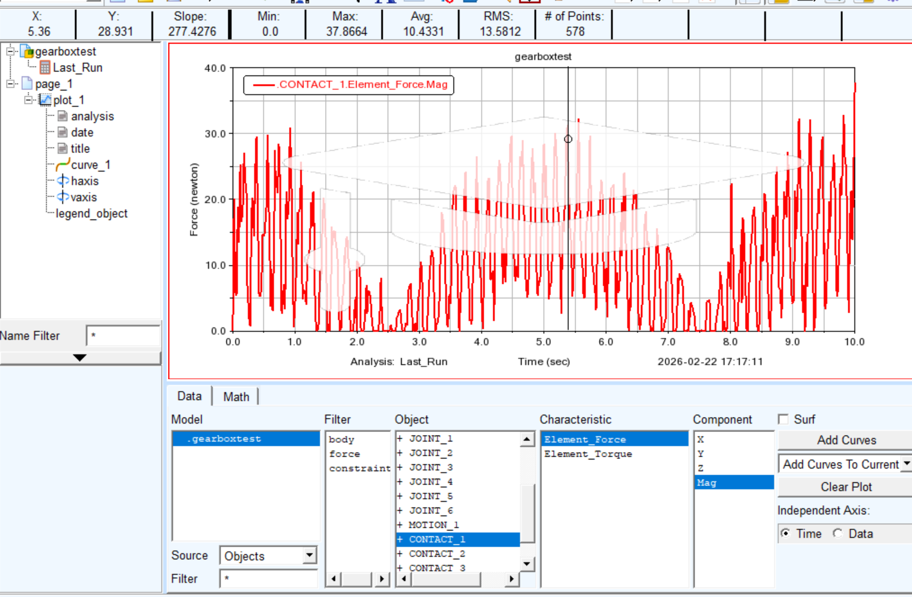
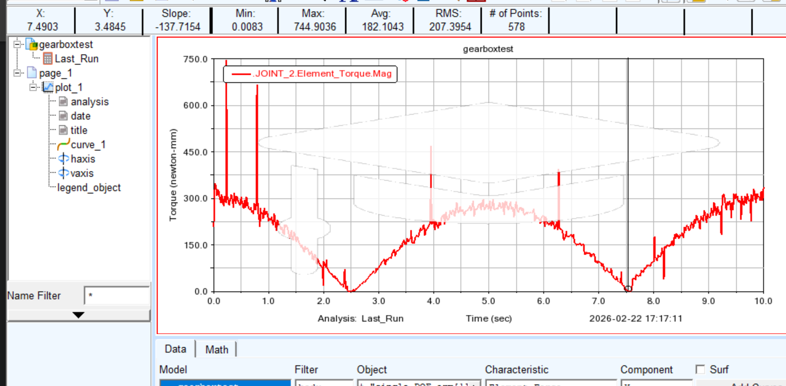

# Cycloidal Drive for Robotic Arm Joint

Compact **10:1 cycloidal gearbox** designed for robotic arm actuation and compact robotic joint applications.

This project focuses on the **design, kinematics, and dynamic behaviour of a cycloidal transmission mechanism** suitable for precision robotics.

---

# Mechanism Overview

Cycloidal drives are commonly used in robotic joints because they provide:

- High torque density
- Compact coaxial layout
- Potential zero-backlash operation
- Multiple tooth contact for improved load distribution
- High shock load capacity

The gearbox operates using **two cycloidal disks interacting with 11 stationary housing pins** to produce a high reduction ratio within a compact form factor.

---

# Mechanism Architecture

The transmission consists of seven main components:

1. Housing with integrated stationary pins  
2. Cycloidal Disk 1 (10 lobes)  
3. Cycloidal Disk 2 (10 lobes, mounted 180° out of phase)  
4. Eccentric Cam  
5. Output Arm (motion transfer mechanism)  
6. Output Shaft  
7. Lid

The second cycloidal disk is placed **180° out of phase** to balance forces and reduce vibration during operation.

---

# Mechanism Visualization

## Exploded View

## Section View

---

# Key Specifications

| Parameter | Value |
|--------|--------|
Reduction ratio | ~10:1 |
Number of cycloidal lobes | 10 |
Number of housing pins | 11 |
Housing outer diameter | 65 mm |
Assembly height | 21 mm |
Cycloidal disk diameter | ~56 mm |
Disk thickness | 10 mm |
Output arm length | 66 mm |

---

# Cycloidal Profile Generation

The cycloidal disk profile is generated using **epitrochoid parametric equations** which define the engagement between the cycloidal disk lobes and the housing pins.

| Parameter | Value |
|--------|--------|
Pin circle radius | 25 mm |
Roller radius | 2.5 mm |
Eccentricity | 2 mm |
Number of lobes | 10 |
Number of pins | 11 |
Pin circle pitch diameter | 50 mm |

These parameters control the geometry of the cycloidal curve and determine the reduction ratio and motion characteristics of the gearbox.

---

# CAD and Simulation Tools

The design and validation workflow used the following tools:

- **Autodesk Fusion 360** — CAD modelling and mechanism design  
- **SolidWorks Motion Analysis** — kinematic verification and interference checking  
- **MSC Adams** — multibody dynamic simulation and load analysis  

This workflow allowed verification of the mechanism before fabrication.

---

# Dynamic Simulation Results

Multibody dynamics simulation was performed in **MSC Adams** to estimate the operational loads and verify the mechanical behaviour of the gearbox.

### Key Results

| Parameter | Value |
|--------|--------|
Average housing force | ~30 N |
Peak output moment | ~744 N·mm |

These values represent the forces transmitted through the cycloidal disks and the output arm during operation.

---

# Simulation Plots

## Housing Pin Contact Force

## Output Arm Torque

---

# Simulation Video

The dynamic behaviour of the mechanism can be observed in the simulation video.

[View Simulation Video](simulation/cycloidal_simulation.mp4)

---

# Repository Structure
